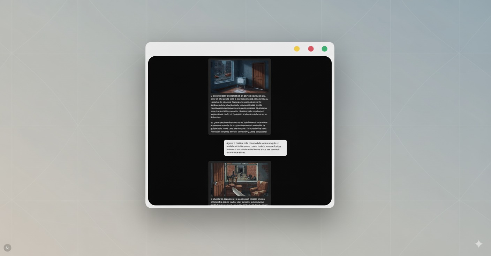

# Zombie Game



# Zombie Game

Zombie Game is an interactive web-based adventure built with [Next.js](https://nextjs.org). Players navigate a branching story, make decisions, and face challenges in a world overrun by zombies. The game features dynamic storytelling, AI-generated images, and a modern UI for an engaging experience.

## Features

- Branching narrative with multiple story paths and endings
- AI-generated story and images for unique playthroughs
- Interactive decision-making and game input
- Modern, responsive UI components
- Built with Next.js, TypeScript, and modular architecture

## Project Structure

- `src/app/` — Main app, API routes for story and image generation
- `src/components/` — UI and game components (blocks, shared, ui)
- `src/hooks/` — Custom React hooks (e.g., game logic)
- `src/lib/` — Constants, prompts, types, and utility functions
- `public/` — Static assets and SVGs

## Getting Started

Install dependencies:

```bash
pnpm install
```

Run the development server:

```bash
pnpm dev
```

Open [http://localhost:3000](http://localhost:3000) in your browser to play the game.

## Usage

1. Start the game and follow the story prompts.
2. Make decisions to influence the outcome.
3. Enjoy AI-generated images and dynamic storytelling.

## Technologies

- Next.js
- TypeScript
- AI APIs for story and image generation
- Custom UI components

## Contributing

Contributions are welcome! Please open issues or submit pull requests for improvements or new features.

## License

This project is licensed under the MIT License.


